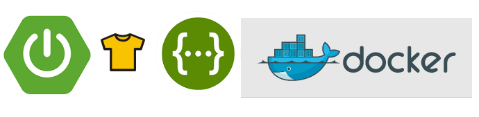

<p align="center"></p>

# track-your-tasks

Simple Micro-Service storing tasks duration and calculating the average

### Goals ###

This is a simple project, to demonstrate some features of MicroServices 12 Factors App Paradigm.
We started with a few independent features and we are going to enlarge these features 
to reach the MS paradigm, completely.

This service provide simple feature for insert of task execution stats such as task id and task duration in milliseconds.
Service interface is composed by two end-points:
 * POST /tasks/add - insert end-point accepting a sample JSON as following:
 ```json 
 {
    "taskId": "alphanumericId",
    "duration": 200
 }``` 
  as aswer the user receive a string : ok or error
 ```
 * GET /task/stats/{taskId} - retrieve average duration within all stored tasks with same id, available answer are :
 ```javascript
    1- [200] Statistic JSON :
    {
        "taskId": "alphanumericId",
        "average": 200.0
    }
    2- [400,404,500] Error JSON :
    {
        "code": "NOT_FOUND",
        "message": "Task id sdfasf not found",
        "name": "myexceptionclassname"
    }
 ```


### Technology ###

Technology stack:
* [Spring Boot](https://projects.spring.io/spring-boot/) (many libraries)
* [H2 Database](http://www.h2database.com/html/main.html)
* [PowerMock](https://github.com/powermock/powermock/wiki/GettingStarted)
* [JUnit](http://junit.org/junit4/)
* [Jacoco](http://www.eclemma.org/jacoco/)

Featured:
* [MySql Server](https://www.mysql.com/)


### Architecture ###

MicroService Architecture is used to define resilient applications. All information
 are stored in an external resource, we can configure. This service supply features related 
 to save data about task we execute in other services and collect this data, then it provides 
 the average of the duration for multiple repetition of the same task, identified by an unique Id.

This MicroService has been designed to be released in Cloud/Private DC with following platforms:
* [Docker machines](https://docs.docker.com/machine/)
* [Docker-Swarm (Portainer.io)](http://portainer.io/)
* [MESOS (Marathon)](http://mesos.apache.org/)
* [Kubernets](https://kubernetes.io/)
* [Spinnaker pipeline to the cloud/PDC](https://www.spinnaker.io/)
* Other resilient container managers

The available databases :
* [H2 or similar grammar embedded databases](http://www.h2database.com/html/main.html)
* [MySql Server](https://www.mysql.com/)
* [Aurora](https://aws.amazon.com/blogs/aws/highly-scalable-mysql-compat-rds-db-engine/)
* [Oracle](https://www.oracle.com/database/index.html)
* [SQL Server](https://www.microsoft.com/en-us/sql-server/sql-server-2016)
* [PostgreSQL](https://www.postgresql.org/)
* And many other autoincrement RDS

We are defining a new feature for the remote logging of event, just to demonstrate the
effective power of MicroServices. We are going to define with a similar architecture a dashboard 
to monitor instances. Please leave a comment if you are interested in demonstration on remote-control 
and docker images TelePort directly from dashboard commands.


### How we can define and modify the datasource script? ###

Datasource SQL script is provided into the resources folder : `schema-h2.sql`.
Schema in many other databases is the same for Database. You can define a custom :
application.properties (Spring Boot configuration file) and replace the original one with 
following command line argument in the java command : `-Dspring.config.location=/location/to/your/configurationfile` and 
disable the auto-definition of the data-structure if you decide to run custom commands and provisioning the database externally as
described in the [Spring configuration guide](https://docs.spring.io/spring-boot/docs/current/reference/htmlsingle/#boot-features-configure-datasource) 
and you can also refer to the [common application properties](https://docs.spring.io/spring-boot/docs/current/reference/html/common-application-properties.html) 
to get inspiration.

### Pre-Requisites ###

This is a maven project, written in Java8, so you need :
* [Oracle Java 8](http://www.oracle.com/technetwork/java/javase/downloads/jdk8-downloads-2133151.html)
* [Maven](https://maven.apache.org/install.html)
* Internet connection for downloading required artifacts.

Optionally for DevOps (to run the resilient container released soon):
* [Docker](https://www.docker.com/get-docker)
* [Docker compose](https://docs.docker.com/compose/install/)


### Installation ###

Clone this project:
```bash
    git clone https://github.com/hellgate75/track-your-tasks.git
    cd track-your-tasks
```

Inside the project folder ...


To create the runnable jar binaries run :
```bash
    mvn -U -UP clean install
```


To create documentation jars run :
```bash
    mvn javadoc:jar
```


### Run the Micro-Service ###

This Micro-Service must be, first of all built, the in the project root folder you can execute on of following commands.


To execute java jar binaries run :
```bash
    java -jar target/track-your-tasks-0.0.1-SNAPSHOT-spring-boot.jar
```


If you want specify an environment variable named `APP_ENV` (e.g. : DEV,INT,PROD) you can run :
```bash
    java -jar target/track-your-tasks-0.0.1-SNAPSHOT-spring-boot.jar
```
In this case in the jar path you need to put a custom property file named application-{APP_ENV lower case}.properties


Using docker:
After you have built the source you can run a custom MySQL environment behalf a docker compose file running:
```bash
    docker-compose --file docker-compose-dev.yaml up -d
```
Then when you have tested the app and/or if you want delete containers and images you can run: 
```bash
    docker-compose --file docker-compose-dev.yaml down -v
    docker rmi -f track_your_tasks_app
    docker rmi -f track_your_tasks_db
    
```


You can send some requests via curl or any browser REST api plugin.


### Test the Micro-Service ###

Using curl to insert task data :
```bash
    curl -X POST -H 'Content-Type: application/json;Accept: text/plain' -d '{"taskId":"sdadaduut7564","duration":700}' http://localhost:8090/tasks/add 
    answer:
    ok
    curl -X POST -H 'Content-Type: application/json;Accept: text/plain' -d '{"taskId":"sdadaduut7564","duration":1100}' http://localhost:8090/tasks/add 
    answer:
    ok
    curl -X POST -H 'Content-Type: application/json;Accept: text/plain' -d '{"taskId":"sdadaduut7564","duration":900}' http://localhost:8090/tasks/add 
    answer:
    ok
```

Using curl to read task average data :
```bash
    curl -X GET -H 'Content-Type: application/json;Accept: application/json' http://localhost:8090/tasks/stats/sdadaduut7564
    answer:
    {
      "taskId": "sdadaduut7564",
      "average": 900.0
    }
```

The same is for a web browser Rest plugin (Advance REST client):

Insert a task data:

<p align="center"></p>

Read task average data :

<p align="center"></p>

### Quality ###

The application is provisioned of unit and integration test, running multiple application instance and executing isolated test scenarios. Test reports are provided in the target folder.


### Road-Map ###

We are preparing a full experience with docker machine and container based MicroService configuration.
In the test sample we have connected a local h2 database. 

In the plan there are demonstrations around:
* Security
* Remote configuration
* Remote control
* Alerts
* Auto-Restart for maintainability purposes
* Other interesting features

Please take a read to the [12 factor app](https://12factor.net/) before engage to the next releases.

We have been releasing soon a docker-compose version
within a MySql database and a custom configuration injected in the application, in order to read and save data
from a new datasource across a private docker network. The new database will not be accessible from the machine.
The next next adventure will be the definition of the Kubernetes files, to deploy int a cluster the app, with a scaling 
policy, and the automated kubectl and helm scripts.

### LICENSE ###

[MIT License](/LICENSE)