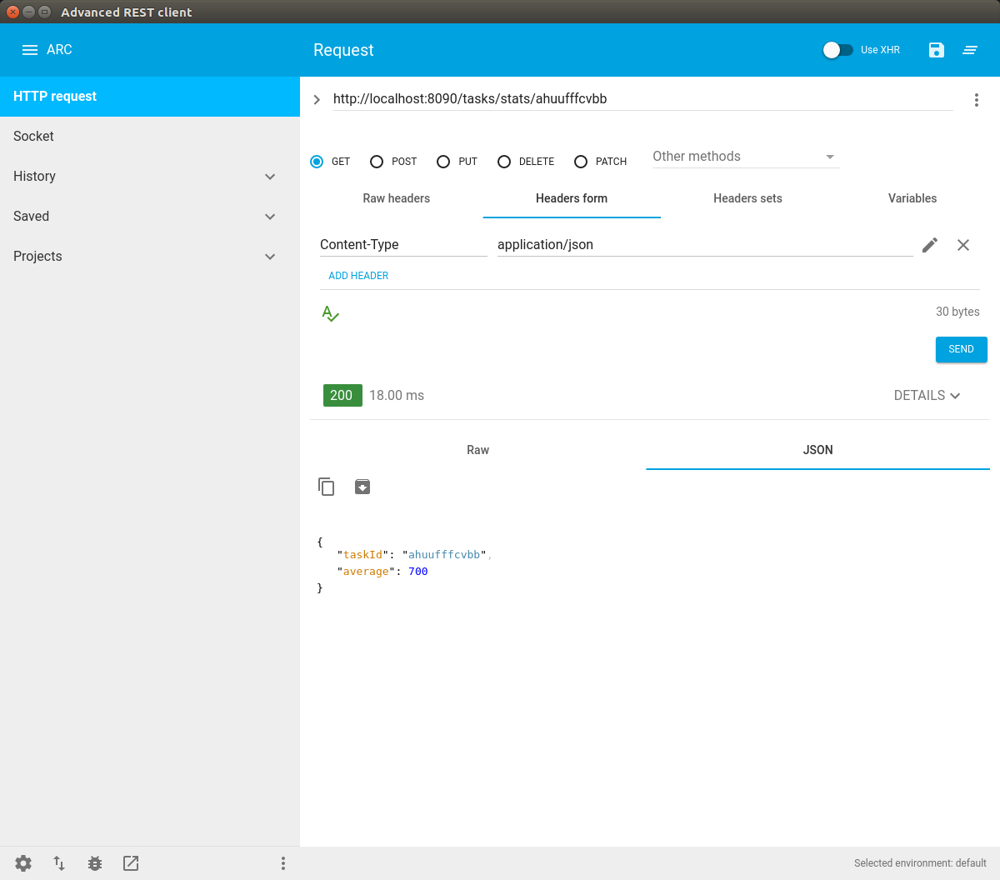

# track-your-tasks

Simple Micro-Service storing tasks duration and calculating the average

### Goals ###

This service provide simple feature for insert of task execution stats such as task id and task duration in milliseconds.
Service interface is composed by two end-points:
 * POST /tasks/add - insert end-point accepting a sample JSON as following:
 ```json 
 {
    "taskId": "alphanumericId",
    "duration": 200
 }``` 
  as aswer the user receive a string : ok or error
 ```
 * GET /task/stats/{taskId} - retrieve average duration within all stored tasks with same id, available answer are :
 ```javascript
    1- [200] Statistic JSON :
    {
        "taskId": "alphanumericId",
        "average": 200.0
    }
    2- [400,404,500] Error JSON :
    {
        "code": "NOT_FOUND",
        "message": "Task id sdfasf not found",
        "name": "myexceptionclassname"
    }
 ```


### Pre-Requisites ###

This is a maven project, written in Java8, so you need :
* Java 8
* Maven
* Internet connection for downloading libraries

Optionally (to run the resilient container released soon):
* Docker
* Docker compose 


### Installation ###

Clone this project:
```bash
    git clone https://github.com/hellgate75/track-your-tasks.git
    cd track-your-tasks
```

Inside the project folder ...

To create the runnable jar binaries run :
```bash
    mvn -U -UP clean install
```

To create documentation jars run :
```bash
    mvn javadoc:jar
```

To execute java jar binaries run :
```bash
    java -jar target/track-your-tasks-0.0.1-SNAPSHOT-spring-boot.jar
```

You can send some requests via curl or any browser REST api plugin.


### Test the Micro-Service ###

Using curl to insert task data :
```bash
    curl -X POST -H 'Content-Type: application/json' -d '{"taskId":"sdadaduut7564","duration":700}' http://localhost:8090/tasks/add 
    answer:
    ok
    curl -X POST -H 'Content-Type: application/json' -d '{"taskId":"sdadaduut7564","duration":1100}' http://localhost:8090/tasks/add 
    answer:
    ok
    curl -X POST -H 'Content-Type: application/json' -d '{"taskId":"sdadaduut7564","duration":900}' http://localhost:8090/tasks/add 
    answer:
    ok
```

Using curl to read task average data :
```bash
    curl -X POST -H 'Content-Type: application/json' http://localhost:8090/tasks/stats/sdadaduut7564
    answer:
    {
      "taskId": "sdadaduut7564",
      "average": 900.0
    }
```

The same is for a web browser Rest plugin (Advance REST client):

Insert a task data:

<p align="center"></p>

Read task average data :

<p align="center"></p>

### Quality ###

The application is provisioned of unit and integration test, running multiple application instance and executing isolated test scenarios. Test reports are provided in the target folder.


### Road-Map ###

We are preparing a full experience with docker machine and container based MicroService configuration.
In the test sample we have connected a local h2 database. We have been releasing soon a docker-compose version
within a MySql database and a custom configuration injected in the application, in order to read and save data
from a new datasource across a private docker network. The new database will not be accessible from the machine.
The next next adventure will be the definition of the Kubernetes files, to deploy int a cluster the app, with a scaling 
policy, and the automated kubectl and helm scripts.

### LICENSE ###

[MIT License](/LICENSE)